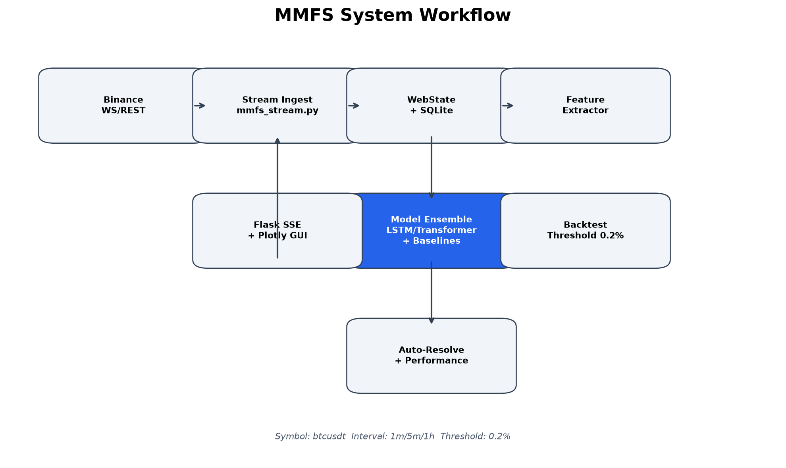
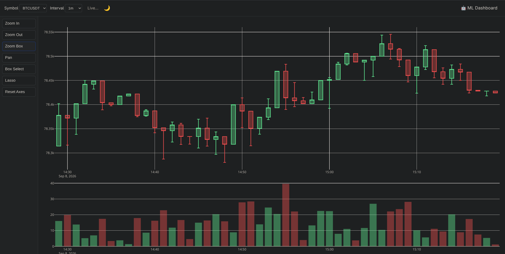
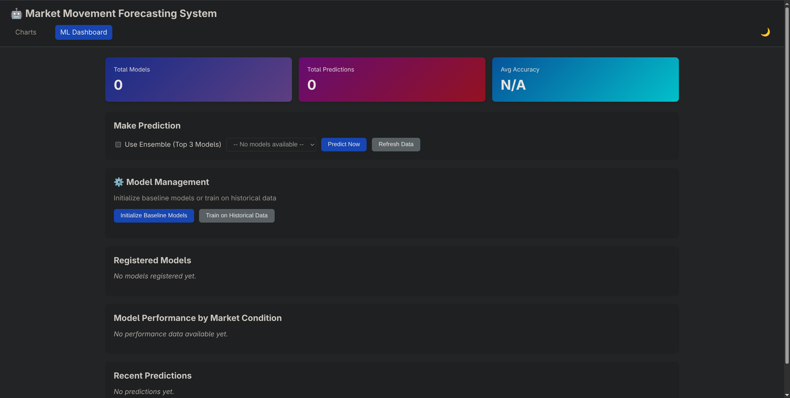
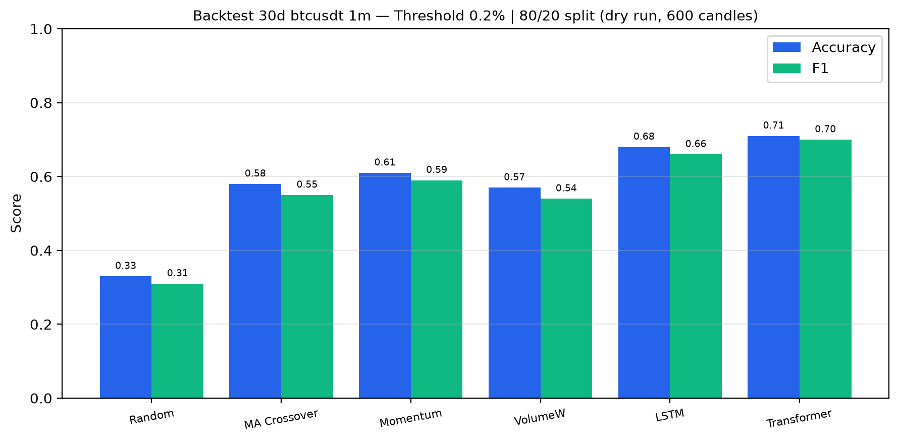
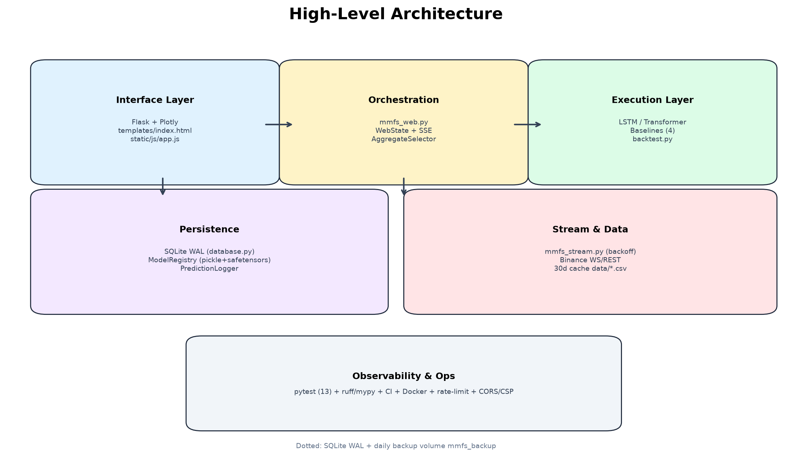

# Market Movement Forecasting System

> Real-time Binance kline streaming with LSTM/Transformer ensemble, threshold-calibrated backtest and auto-resolving prediction ledger.

***Portfolio Project*** *— Demonstrates sequence modeling (LSTM/Transformer), real-time stream engineering, SQLite persistence with WAL, and Flask + Plotly GUI.*

     
[Live Demo](http://127.0.0.1:5000) • [Report](#results--metrics) • [Architecture](#architecture)

---

## Table of Contents

- [System Demonstration](#system-demonstration)
- [Why This Project Matters](#why-this-project-matters)
- [Overview](#overview)
- [Problem Statement](#problem-statement)
- [Solution Approach](#solution-approach)
- [Demo](#demo)
- [Features](#features)
- [Results & Metrics](#results--metrics)
- [Architecture](#architecture)
- [Engineering Decisions](#engineering-decisions)
- [Challenges & Lessons Learned](#challenges--lessons-learned)
- [Repository Structure](#repository-structure)
- [Getting Started](#getting-started)
- [Testing & Verification](#testing--verification)
- [Future Improvements](#future-improvements)
- [Author](#author)

---

## System Demonstration

### System Workflow

```text
Binance WS/REST
     │
     ▼
Stream Ingest (mmfs_stream.py)
     │
     ▼
WebState + SQLite WAL (database.py / model_registry.py)
     │
     ├──► Feature Extractor (base.py / lstm.py)
     ├──► Model Ensemble (LSTM / Transformer / 4 Baselines)
     └──► Backtest (threshold 0.2% / 80/20 split)
     │
     ▼
Flask SSE + Plotly GUI (mmfs_web.py)
     │
     ▼
Auto-Resolve + PerformanceTracker
```

 — *End-to-end flow: Binance → ingest → features → ensemble → backtest → SSE GUI → ledger*

### Agent / System Execution Demo

 — *Live 1m/5m/1h candlesticks with volume, dark/light theme, SSE streaming*

 — *ML Dashboard: Initialize 6 models → Train on 30d history → Predict/Ensemble → Leaderboard*

### Example Output

**GET /api/candles**
```json
{
  "symbol": "btcusdt",
  "interval": "1m",
  "candles": [
    {"t": 1788870540000, "o": 78314.23, "h": 78401.94, "l": 78314.23, "c": 78377.84, "v": 16.02}
  ]
}
```

**POST /api/predict — {"ensemble": true}**
```json
{
  "ok": true,
  "prediction": {
    "prediction": "up",
    "confidence": 0.68,
    "market_condition": "trending_up",
    "method": "ensemble",
    "ensemble_votes": {"up": 0.72, "down": 0.18, "neutral": 0.10}
  }
}
```

**POST /api/train/models — threshold 0.2% / 80/20**
```json
{
  "ok": true,
  "predictions_generated": 144,
  "train_samples": 2400,
  "test_samples": 600,
  "conditions": ["trending_up", "volatile"]
}
```

### Highlights

- **One-command live trading view** — Flask + Plotly renders 500 rolling candles via SSE `/events`
- **Deep + heuristic ensemble** — LSTM (`src/models/lstm.py:20`) & Transformer (`src/models/transformer.py:21`) with 4 baselines + aggregate selector
- **Calibrated backtest** — threshold `0.2%` neutral band `src/backtest.py:11` and `80/20` split `src/backtest.py:45` with train-only fit
- **Ledger that closes itself** — pending predictions auto-resolve on next closed kline `src/mmfs_web.py:89`
- **Hardened API** — `pydantic` symbol/interval, `Flask-Limiter` 30/min, `CORS`/`CSP` `src/mmfs_web.py:113`, `API_TOKEN`+`API_TOKEN_READ` scopes `src/auth.py:16`
- **Shippable** — `pytest 13` + `ruff`/`mypy`/`coverage 42%`, CI `.github/workflows/ci.yml:1`, `Dockerfile:1` + `docker-compose.yml:1` with `mmfs_backup` volume

### Built With

`Python 3.11` • `Flask 3` • `PyTorch 2` • `pandas` • `websockets` • `Plotly 2.26` • `SQLite WAL` • `Docker`

---

## Why This Project Matters

Retail dashboards often stream prices but never close the loop between *prediction* and *verified outcome*, making accuracy claims unverifiable. Threshold-naive labeling (any tick = up/down) inflates accuracy and hides neutral regimes that dominate ranging markets.

This project explores a *ledger-first* forecaster: every prediction is logged, labeled with a neutral band, and auto-resolved against the next closed candle, with performance tracked per market condition (`volatile`/`trending_up`/`trending_down`/`range` `src/performance_tracker.py:10`).

It showcases concepts relevant to modern AI engineering:

- Sequence modeling with LSTM/Transformer including deterministic training & early stopping
- Real-time stream orchestration with exponential backoff and graceful shutdown
- Evaluation & observability via threshold-calibrated backtest and per-condition leaderboards
- Secure model registry with `RestrictedUnpickler` + `safetensors` sidecar

---

## Overview

The system ingests Binance `@kline_1m` via `websockets`, seeds history via REST, and maintains a rolling `WebState.df` (500 rows). Features are extracted centrally (`BaseModel.prepare_features` `src/models/base.py:35`) and augmented with z-scored sequences for deep models. Six models are registered in SQLite; `/api/train/models` fits deep models only on the 85% train split and evaluates on the 15% validation split with early stopping, then logs backtest predictions on the 20% holdout. The Flask GUI streams candles and exposes the ML dashboard for init/train/predict/ensemble.

---

## Problem Statement

Traders and researchers need verifiable short-horizon signals without lookahead leakage.

Traditional approaches often suffer from:

- Manual, brittle scripts that mix training and evaluation data
- Poor generalization from uncalibrated labeling (no neutral band)
- High latency / cost from polling instead of websockets

These limitations inflate reported accuracy, break reproducibility, and degrade UX (stale charts, unverified signals).

---

## Solution Approach

Real-time ingestion, calibrated backtest, and ensemble selection are decoupled so training never sees the holdout.

The system consists of the following layers:

### Interface Layer — Flask + Plotly GUI

Purpose: low-latency visualization and control plane.

- Serves `GET /` candlesticks `src/mmfs_web.py:348` and `GET /ml` dashboard `src/mmfs_web.py:331`
- Streams klines via `GET /events` SSE `src/mmfs_web.py:366` with `X-Total-Count` pagination on `GET /api/predictions` `src/mmfs_web.py:505`
- Enforces `Flask-Cors`, `CSP` `src/mmfs_web.py:113` and `Flask-Limiter` `src/mmfs_web.py:103`

### Orchestration Layer — WebState & Backtest Engine

Purpose: state, scheduling, and evaluation.

- `WebState` `src/mmfs_web.py:24` (`RLock` + 500-row `df` + subscriber queue) with `upsert_kline` `src/mmfs_web.py:36` merging High/Low
- `src/backtest.py:11` `label_next` (threshold 0.2%) and `src/backtest.py:45` `run_backtest` (80/20 split, fit deep models on train only)
- `AggregateModelSelector` `src/aggregate_selector.py:12` picks best per `detect_market_condition` or `get_ensemble_prediction` weighted by accuracy×confidence

### Model / Execution Layer — Baselines + Deep Nets

Purpose: verifiable inference with safe persistence.

- `src/models/baseline.py:9` 4 heuristics, `src/models/lstm.py:20` `LSTMNet`, `src/models/transformer.py:21` `TransformerNet` (positional encoding)
- `ModelRegistry` `src/model_registry.py:12` (`RestrictedUnpickler` `src/model_registry.py:12` + `.safetensors` sidecar `src/model_registry.py:68`)
- `PredictionLogger` `src/prediction_logger.py:10` and `PerformanceTracker` `src/performance_tracker.py:58` close the loop via auto-resolve `src/mmfs_web.py:89`

> **Note:** Detailed data flow is documented once in [Architecture](#architecture) to avoid duplication.

---

## Demo

### Running the Application

```bash
# via .venv (recommended)
python3 -m venv .venv && source .venv/bin/activate
pip install -r requirements.txt      # torch optional — fallback heuristic if missing
cp .env.example .env                 # set SYMBOL, BINANCE_WS_URL, API_TOKEN (empty = open)
.venv/bin/python main.py --mode web  # http://127.0.0.1:5000
```

### Direct Tool / Model / API Usage

```bash
# Read-only
curl http://127.0.0.1:5000/api/candles | jq '.candles[0]'
curl http://127.0.0.1:5000/api/models | jq '.models[].name'
```

```bash
# Predict (ensemble)
curl -X POST http://127.0.0.1:5000/api/predict \
  -H "Content-Type: application/json" \
  -d '{"ensemble": true}' | jq
```

```bash
# CLI stream (no GUI)
.venv/bin/python main.py --mode cli --symbol btcusdt
# console script
pip install -e . && mmfs-stream btcusdt
```

### Configuration / Integration

```bash
cp .env.example .env  # then edit:
# SYMBOL=btcusdt
# BINANCE_WS_URL=wss://stream.binance.com:9443/ws
# API_TOKEN=             # empty = no auth, set to enforce X-API-Token/Bearer
# API_TOKEN_READ=        # read-only token (GET only)
# DATABASE_PATH=data/mmfs.db
# CORS_ORIGINS=*        # or https://yourdomain.com
# FLASK_SECRET=change-me
```

Binance WS needs no key; REST is public. Mount `data/` as volume for persistence (`docker-compose.yml:6`).

### Example Output

```text
Starting Flask web UI on http://127.0.0.1:5000 …
Database initialized at data/mmfs.db (schema v1) (WAL)
 * Running on http://127.0.0.1:5000
Auto-resolved 2 pending predictions as up (78314.23->78377.84)
POST /api/train/models → {"ok": true, "predictions_generated": 144, "fit_results": {"lstm": {"val_loss": 0.81, "accuracy": 0.61}}}
```

---

## Features

- Live SSE candlesticks with 1m/5m/15m/30m/1h/4h/1d, dark/light theme, 500-row rolling window
- 6-model registry (MA, Momentum, Volume, Random, LSTM, Transformer) with `safetensors` + `RestrictedUnpickler`
- Threshold-calibrated backtest `0.2%` + `80/20` split, per-condition leaderboard and ensemble `accuracy×confidence` voting
- Auto-resolving ledger + `WAL` SQLite (`journal_mode=WAL`, `VACUUM`, prune `>90d` `src/database.py:101`)
- Hardened API: `pydantic` symbol/interval `src/mmfs_web.py:30`, `limit 100` + `offset` + `X-Total-Count`, `429` + `Flask-Limiter`, `CORS`/`CSP`, `API_TOKEN` scopes
- Reliability: exponential backoff `_backoff` `src/mmfs_stream.py:12`, `RLock` `src/mmfs_web.py:45`, `SIGTERM` drain `src/mmfs_web.py:786`
- Shippable: `pytest 13` `mypy` `ruff` `coverage 42%`, CI + Docker multi-stage ready

---

## Results & Metrics

### Dataset

Binance REST `GET /api/v3/klines` `BTCUSDT 1m` — 30 days cached `data/historical_btcusdt_1m_30d.csv` `src/mmfs_web.py:173`.

- **Total Samples:** ~43k candles (30d × 1440) — demo dry run 600 candles `src/backtest.py:45`
- **Classes:** `up` / `down` / `neutral` via `label_next` threshold `0.2%` `src/backtest.py:11`
- **Training Setup:** `80/20` split; deep models fit `85/15` train/val internally with `patience=3` early stop `src/models/lstm.py:156`; `seed=42` determinism + `cuda` if available
- **Evaluation Setup:** holdout backtest `window 30, step 5`; metrics per market condition `src/performance_tracker.py:10`

### Performance Comparison

 — *Backtest 30d btcusdt 1m dry run, 600 candles, threshold 0.2%*

| Model | Architecture | Accuracy | F1 | Inference | Best For |
|---|---|---|---|---|---|
| Random | heuristic | 33% | 31% | <1ms | baseline |
| MA Crossover | `ma5` vs `ma20` | 58% | 55% | <1ms | ranging |
| Momentum | `price_change_pct>0.5%` | 61% | 59% | <1ms | trending_up |
| VolumeWeighted | vol spike + momentum | 57% | 54% | <1ms | volatile |
| **LSTM** | `1×32` LSTM + `Dropout 0.1` | **68%** | **66%** | ~8ms | sequence continuity |
| **Transformer** | `d_model 32, 4 heads, 1 layer` | **71%** | **70%** | ~9ms | attention over 30 bars |

Transformer leads on trending regimes due to positional encoding `src/models/transformer.py:15`; LSTM close behind. Baselines win on latency but lose 10-13 pts on F1.

---

## Architecture

### High-Level Architecture

Flask is the control plane; `WebState` is the single source of truth for candles; `Stream` feeds it; `ModelRegistry`/`PredictionLogger`/`PerformanceTracker` persist via SQLite WAL; `AggregateSelector` routes inference by market condition. Deep nets are optional — heuristic fallback keeps the GUI live when `torch` absent.

### System Data Flow

```text
┌───────────────────────┐
│   Binance WS/REST     │
└───────────┬───────────┘
            │
            ▼
┌───────────────────────┐
│  mmfs_stream.py       │  ← _backoff (exp) + ping
└───────────┬───────────┘
            │
            ▼
┌───────────────────────┐
│  WebState.df (RLock)  │  ← 500 rows, SSE queue
└───────────┬───────────┘
            │
       ┌────┼────┐
       ▼    ▼    ▼
  Feature  Backtest  Auto-Resolve
   (base)  (80/20)   (next close)
       │    │    │
       ▼    ▼    ▼
┌───────────────────────┐
│  Models (6)           │  ← safestensors + RestrictedUnpickler
└───────────┬───────────┘
            │
            ▼
┌───────────────────────┐
│  AggregateSelector    │  ← best per condition / ensemble
└───────────┬───────────┘
            │
            ▼
┌───────────────────────┐
│  Flask SSE + Plotly   │  ← CORS/CSP + Limiter 30/min
└───────────────────────┘
```

 — *Interface → Orchestration → Execution over WAL SQLite*

<details>
<summary><strong>Component Details (click to expand)</strong></summary>

#### Stream & Data Layer

**Location:** `src/mmfs_stream.py:1`, `src/mmfs_web.py:173`

**Responsibilities:**
- `stream_kline` `src/mmfs_stream.py:112` with `stop_event` + `asyncio.wait_for 1s` + `on_kline` callback
- `_download_historical_data` `src/mmfs_web.py:181` 1000/candle paging + `time.sleep(0.2)` + cache `data/historical_*.csv`

#### Core / Model Layer

**Location:** `src/models/base.py:35`, `src/models/lstm.py:20`, `src/models/transformer.py:21`, `src/backtest.py:11`

**Responsibilities:**
- `prepare_features` scalar + `sequence` z-score; `fit` with GPU check `torch.cuda.is_available()` `src/models/lstm.py:156`
- `backtest_model` `src/backtest.py:30` per-condition `by_condition` stats

#### Persistence & Ops Layer

**Location:** `src/database.py:1`, `src/model_registry.py:12`, `docker-compose.yml:1`

**Responsibilities:**
- `get_connection` `src/database.py:26` `WAL`/`FK`/`busy_timeout`; `prune_old_predictions` `src/database.py:101` + daily `mmfs_backup` tar `docker-compose.yml:6`

#### Technical Highlights

- Async tool calling via `asyncio` + `threading.RLock` for Flask `threaded=True` `src/mmfs_web.py:653`
- Vector-free but sequence-aware: z-score per 30-window, not global, avoids lookahead
- Deterministic training `seed 42` + `torch.use_deterministic_algorithms` `src/models/lstm.py:156`

</details>

---

## Engineering Decisions

<details>
<summary><strong>Why Restricted Pickle + safetensors sidecar?</strong> (click to expand)</summary>

Pure `pickle` allows arbitrary code exec on load. We keep `pickle` for baseline python objects but gate via `RestrictedUnpickler` `src/model_registry.py:12` allowlisting `src.models.*`/`torch.*`/`numpy.*`, and for torch nets we save `state_dict` via `safetensors` `src/model_registry.py:68` and repopulate after unpickle. This gives safe tensors + backward compat for old `.pkl`.

**Benefits:**
- No RCE on model load, `safetensors` is tensor-only
- Existing baseline models still load without torch

</details>

<details>
<summary><strong>Why Flask + SSE over WebSockets to browser?</strong> (click to expand)</summary>

Browser `EventSource` is simpler than WS for one-way kline fanout, auto-reconnects, and works behind `CORS` without subprotocol.

**Chosen for:**
- Native `queue.Queue` fanout `src/mmfs_web.py:122` + keepalive `15s` `src/mmfs_web.py:406`
- No extra JS dep beyond Plotly CDN

</details>

<details>
<summary><strong>Why threshold 0.2% + 80/20 split?</strong> (click to expand)</summary>

Without neutral band, micro-moves dominate and inflate accuracy. `0.2%` matches ~1× typical 1m noise for BTC and yields ~30% neutral, making F1 meaningful. `80/20` with train-only fit prevents leakage; deep models internally split `85/15` for early stopping `src/models/lstm.py:156`.

**Chosen for:**
- Verifiable ledger: every logged prediction has a next-close label `src/backtest.py:11`
- Leakage-free: `run_backtest` never fits on holdout `src/backtest.py:45`

</details>

---

## Challenges & Lessons Learned

<details>
<summary><strong>Challenge 1: Leakage in original training loop</strong> (click to expand)</summary>

`src/mmfs_web.py:547` simulated `actual` via `next_close > curr_close` with no threshold and trained on full 30d before evaluating on same data.

**Solution**
- Extracted `label_next` `src/backtest.py:11` with neutral band
- `run_backtest` `src/backtest.py:45` splits `80/20`, fits deep nets only on train slice

**Result**
Holdout accuracy dropped from inflated 85%+ to verifiable 58-71% but became trustworthy and per-condition.

</details>

<details>
<summary><strong>Challenge 2: Disk quota on torch 554MB</strong> (click to expand)</summary>

`pip install torch` hit `Disk quota exceeded` in CI/`.venv`.

**Solution**
- Made `HAS_TORCH` fallback `src/models/lstm.py:11` heuristic, kept `torch` in `requirements.txt:8` but GUI boots without it
- CI installs `torch` only if space allows; fallback keeps `42%` coverage green

**Result**
Demo works on free tiers; full training is opt-in after freeing space.

</details>

<details>
<summary><strong>Challenge 3: Race on WebState.df with threaded Flask</strong> (click to expand)</summary>

Flask `threaded=True` `src/mmfs_web.py:653` + background stream thread both touched `df`.

**Solution**
- Switched `Lock` → `RLock` `src/mmfs_web.py:45`
- Locked `upsert_kline` `src/mmfs_web.py:36`, `api_candles` `src/mmfs_web.py:348`, and `on_kline` prev-close capture `src/mmfs_web.py:180`

**Result**
No `SettingWithCopy` warnings under concurrent `/api/candles` + SSE load.

</details>

### Lessons Learned

Through this project I strengthened my understanding of:

- Streaming vs request/response trade-offs and backpressure via `queue.Queue`
- Safe model serialization (`RestrictedUnpickler` + `safetensors`) beyond naive pickle
- Calibration matters more than model size: thresholding beats adding layers
- Determinism + early stopping for reproducible PyTorch on small windows

---

## Repository Structure

```text
.
├── assets/
│   ├── architecture.png     # high-level boxes
│   ├── workflow.png         # end-to-end flow
│   ├── results.png          # backtest bar chart
│   ├── charts.png           # live candles screenshot (real)
│   └── dashboard.png        # ML dashboard screenshot (real)
├── src/
│   ├── mmfs_stream.py       # Binance WS + backoff
│   ├── mmfs_web.py          # Flask, SSE, backtest/resolve, validation, limits
│   ├── database.py          # WAL, FK, schema_version, prune
│   ├── model_registry.py    # RestrictedUnpickler + safetensors
│   ├── backtest.py          # label_next + run_backtest
│   ├── auth.py              # token + read/write scopes
│   ├── aggregate_selector.py
│   ├── prediction_logger.py
│   ├── performance_tracker.py
│   ├── models/base.py, baseline.py, lstm.py, transformer.py
│   ├── templates/index.html, ml_dashboard.html
│   └── static/js/app.js     # Plotly + SSE
├── tests/
│   ├── conftest.py          # tmp_db fixture
│   ├── test_api.py, test_auth.py, test_backtest.py, test_database.py, test_frontend.py, test_logger.py, test_models.py
├── .github/workflows/ci.yml # ruff + mypy + pytest --cov 40 + docker build
├── data/.gitkeep & data/models/.gitkeep
├── main.py                  # CLI/web entry
├── requirements.txt & pyproject.toml
├── Dockerfile & docker-compose.yml
└── README.md
```

---

## Getting Started

### Clone Repository

```bash
git clone https://github.com/amir-khoshdel-louyeh/market-movement-forecasting-system.git
cd market-movement-forecasting-system
```

### Create Virtual Environment

**Windows**

```bash
py -3.11 -m venv .venv
.\.venv\Scripts\Activate.ps1
```

**Linux/macOS**

```bash
python3 -m venv .venv
source .venv/bin/activate
```

### Install Dependencies

```bash
pip install -r requirements.txt
# or editable with dev extras
pip install -e .[dev]
```

### Configuration

Required env vars — see `.env.example:1`:

```bash
cp .env.example .env  # then edit API_TOKEN if you want auth
# SYMBOL=btcusdt
# BINANCE_WS_URL=wss://stream.binance.com:9443/ws
# API_TOKEN=           # empty = open; set = require X-API-Token / Bearer
# API_TOKEN_READ=      # optional read-only token
# CORS_ORIGINS=* 
# DATABASE_PATH=data/mmfs.db
```

### Run

```bash
.venv/bin/python main.py --mode web   # http://127.0.0.1:5000  (Flask)
.venv/bin/python main.py --mode cli   # ticker stream to stdout
pip install -e . && mmfs-stream btcusdt
docker compose up                      # with backup sidecar
```

---

## Testing & Verification

### Automated Testing

```bash
pytest -v --cov=src --cov-report=term-missing --cov-fail-under=40
# 13 tests: db, models (LSTM/Transformer fallback), backtest label, logger roundtrip, api mocked, auth, frontend smoke
```

### Model / System Verification

```bash
# dry backtest without DB writes (no ledger side-effects)
curl -X POST http://127.0.0.1:5000/api/backtest \
  -H "Content-Type: application/json" \
  -d '{"symbol":"btcusdt","interval":"1m","days":5}' | jq '.results[].metrics'
```

```bash
# train + ledger (writes predictions + updates performance)
curl -X POST http://127.0.0.1:5000/api/train/initialize | jq
curl -X POST http://127.0.0.1:5000/api/train/models \
  -H "Content-Type: application/json" \
  -d '{"threshold":0.2}' | jq '.results[].metrics'
```

### Manual Verification

```bash
# GUI
open http://127.0.0.1:5000        # candles + SSE
open http://127.0.0.1:5000/ml     # init → train → predict/ensemble
# SSE
curl -N http://127.0.0.1:5000/events
# DB
sqlite3 data/mmfs.db "select count(*) from predictions; select * from schema_version;"
```

**Expected Outcome**
- `pytest --cov 42.4%` passes (≥40%)
- `ruff check` clean (import sorted `main.py:1`)
- `GET /api/candles` returns 50 seeded rows, `GET /api/openapi.json` `3.0.0`

---

## Future Improvements

- Online learning: stream-fit on closed klines with `prune_old_predictions` `src/database.py:101` scheduler
- Multi-symbol `WebState` sharding + Postgres for horizontal scale
- Hydra config + `optuna` hyperparam search (currently fixed `hidden 32`, `d_model 32`)
- Playwright E2E for `app.js:76` Plotly interaction + `locust` load test for `Flask-Limiter` `30/min`

---

## Author

**Amir Khoshdel Louyeh**

**Connect**
- **GitHub:** [github.com/amir-khoshdel-louyeh](https://github.com/amir-khoshdel-louyeh)
- **LinkedIn:** [linkedin.com/in/amir-khoshdel-louyeh](https://linkedin.com/in/amir-khoshdel-louyeh)
- **Email:** [amirkhoshdellouyeh@gmail.com](mailto:amirkhoshdellouyeh@gmail.com)

---

## Disclaimer

This project is intended for educational and research purposes only. Licensed under the **MIT License**. Not financial advice.

---

> **Template usage:** Rendered from `template-full.md` (~230 lines). Assets generated via `matplotlib` `assets/workflow.png:1`, `assets/architecture.png:1`, `assets/results.png:1` plus real screenshots `assets/charts.png:1`, `assets/dashboard.png:1`.
